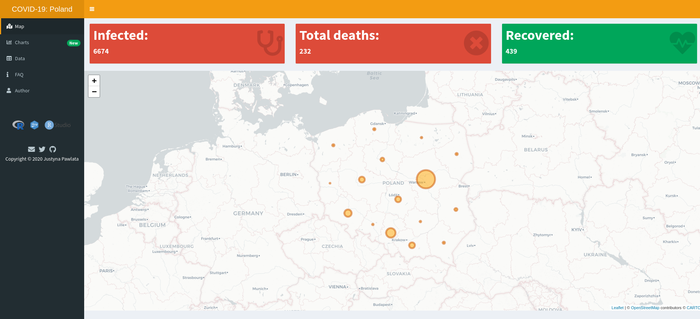

# COVID-19: Poland 

**COVID-19: Poland** was created to store all the information about COVID-19 cases in Poland in one place and show it in a readable way.

Live: [Covid-19:Poland](https://jpawlata.shinyapps.io/covid-19/)

## Data Source

Data about the COVID-19 disease in Poland: [Website of the Republic of Poland](https://www.gov.pl/web/coronavirus) & [Michał Rogalski](https://docs.google.com/spreadsheets/d/1ierEhD6gcq51HAm433knjnVwey4ZE5DCnu1bW7PRG3E/htmlview?usp=sharing#)

Data used to show disease on the map: [Główny Urząd Geodezji i Kartografii](http://www.gugik.gov.pl/)

## Contact

Found a bug or want to ask for a feature? Please, raise [an issue](https://github.com/jpawlata/covid-19/issues) :)

Have a question? Contact me via Twitter [@justynapawlata](https://twitter.com/justynapawlata)

## Software Used
- [R](https://www.r-project.org/)
- [Shiny](https://shiny.rstudio.com/)
- [RStudio](https://rstudio.com/)
- [shinytest](https://rstudio.github.io/shinytest/)
- [plotly](https://plotly.com/)

## Changelog

#### 2.0.0  - 2020/03/18

- recovery box
- charts

#### 1.0.1  - 2020/03/18

- tests (shinytest) with Travis CI

#### 1.0.0  - 2020/03/16

- First release

## License

Copyright &copy; 2020 Justyna Pawlata

Released under the [MIT](https://github.com/jpawlata/covid-19/blob/master/LICENSE) license.

